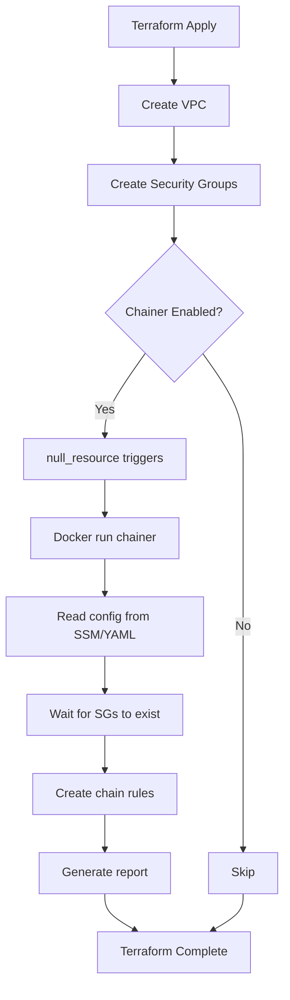

# Security Group Chainer - Terraform Module

Terraform wrapper for executing the security-group-chainer Docker container as part of infrastructure deployment.

## Purpose

Automates creation of security group rules between tiers after all security groups are provisioned. Solves circular dependency issues in Terraform by running as a post-provisioning step.

## Features

- ✅ **SSM Integration**: Reads configuration from AWS SSM Parameter Store
- ✅ **YAML Fallback**: Supports local YAML file if SSM unavailable
- ✅ **Dependency Tracking**: Waits for all security groups to be created
- ✅ **Graceful Failure**: Continues Terraform execution even if chainer fails
- ✅ **Report Generation**: Saves execution report to local file
- ✅ **Docker-based**: No local Python dependencies required

## Usage

### Basic Example (SSM Config)

```hcl
module "security_group_chainer" {
  source = "./security/security-group-chainer"
  
  common_prefix = local.common_prefix
  common_tags   = local.common_tags
  
  chains_config_ssm_parameter = "/forge/security-group-chains"
  aws_region                  = var.aws_region
  
  # Wait for all security groups to be created
  depends_on_resources = [
    module.eks.cluster_security_group_id,
    module.eks.node_security_group_id,
    module.rds.security_group_id,
    module.redis.security_group_id,
    module.alb.security_group_id,
    module.vpc_endpoints.security_group_id
  ]
  
  report_output_path = "${path.root}/reports/security-group-chainer.yaml"
}
```

### Example with Local YAML Config

```hcl
module "security_group_chainer" {
  source = "./security/security-group-chainer"
  
  common_prefix = local.common_prefix
  common_tags   = local.common_tags
  
  chains_config_yaml_path = "${path.root}/config/chains.yaml"
  aws_region              = var.aws_region
  
  depends_on_resources = [
    module.eks.cluster_security_group_id,
    module.eks.node_security_group_id,
    module.rds.security_group_id
  ]
}
```

### Disable Chainer

```hcl
module "security_group_chainer" {
  source = "./security/security-group-chainer"
  
  common_prefix = local.common_prefix
  common_tags   = local.common_tags
  
  enabled = false  # Skip chainer execution
}
```

## Prerequisites

1. **Docker installed** on the machine running Terraform
2. **AWS credentials** configured (`~/.aws/credentials` or environment variables)
3. **Config uploaded to SSM** (if using SSM mode):
   ```bash
   cd forge-helpers/yaml-sync-with-ssm
   python src/sync.py upload chains.yaml \
     --parameter /forge/security-group-chains \
     --validate
   ```

## Workflow



## Configuration Priority

1. **SSM Parameter** (highest priority) - if `chains_config_ssm_parameter` is set
2. **Local YAML** (fallback) - if `chains_config_yaml_path` is set
3. **Error** - if neither is configured

## Execution Triggers

The chainer runs when:
- Dependencies change (security group IDs)
- Config source changes (SSM parameter or YAML path)
- Docker image version changes
- `timestamp()` changes (every apply - can be removed for idempotency)

## Error Handling

- **Chainer fails**: Terraform continues (on_failure = continue)
- **Report generated**: Even on failure, report shows errors
- **Exit code 0**: Chainer exits gracefully with report

## Example Report

After execution, check `report_output_path`:

```yaml
timestamp: "2026-01-13T10:30:00Z"
status: "completed"
chains:
  - name: "alb-to-eks"
    status: "success"
    rules_created: 2
  - name: "eks-to-rds"
    status: "success"
    rules_created: 2
errors: []
```

## Inputs

| Name | Description | Type | Default | Required |
|------|-------------|------|---------|----------|
| common_prefix | Common prefix for resource naming | string | - | yes |
| common_tags | Common tags applied to all resources | map(string) | - | yes |
| chains_config_ssm_parameter | SSM Parameter path for config | string | "/forge/security-group-chains" | no |
| chains_config_yaml_path | Local YAML file path (fallback) | string | "" | no |
| docker_image | Docker image for chainer | string | "ghcr.io/forge/security-group-chainer:latest" | no |
| aws_region | AWS region | string | - | yes |
| timeout_seconds | Chainer timeout | number | 1800 | no |
| enabled | Enable/disable chainer | bool | true | no |
| depends_on_resources | Security group IDs to wait for | list(string) | [] | no |
| report_output_path | Report file path | string | "./security-group-chainer-report.yaml" | no |

## Outputs

| Name | Description |
|------|-------------|
| chainer_executed | Whether chainer was executed |
| config_source | Configuration source (SSM or YAML) |
| report_path | Path to execution report |
| docker_command | Docker command that was executed |
| module_tags | Tags applied by module |

## Integration with Main Terraform

Add to `forge-infrastructure/aws/main.tf`:

```hcl
module "security_group_chainer" {
  source = "./security/security-group-chainer"
  
  common_prefix = local.common_prefix
  common_tags   = local.common_tags
  
  chains_config_ssm_parameter = "/forge/security-group-chains"
  aws_region                  = var.aws_region
  
  depends_on_resources = [
    module.eks.cluster_security_group_id,
    module.eks.node_security_group_id,
    module.rds.security_group_id,
    module.redis.security_group_id,
    module.alb.security_group_id,
    module.vpc_endpoints.security_group_id,
    module.client_vpn.security_group_id
  ]
  
  report_output_path = "${path.root}/reports/security-group-chainer.yaml"
  
  # Run after all security groups are created
  depends_on = [
    module.eks,
    module.rds,
    module.redis,
    module.alb,
    module.vpc_endpoints,
    module.client_vpn
  ]
}
```

## Testing

```bash
# 1. Initialize Terraform
cd forge-infrastructure/aws
terraform init

# 2. Plan (chainer won't run during plan)
terraform plan

# 3. Apply (chainer runs during apply)
terraform apply

# 4. Check report
cat reports/security-group-chainer.yaml
```

## Troubleshooting

### Chainer not executing
- Check `enabled = true`
- Verify Docker is installed: `docker --version`
- Check AWS credentials: `aws sts get-caller-identity`

### Config not found
- SSM: Verify parameter exists: `aws ssm get-parameter --name /forge/security-group-chains`
- YAML: Verify file exists: `ls -la config/chains.yaml`

### Rules not created
- Check report for errors: `cat reports/security-group-chainer.yaml`
- Verify security groups exist: `aws ec2 describe-security-groups --filters Name=tag:Tier,Values=EKSNodes`
- Check chainer logs in Terraform output

## Related Modules

- `security/security-group` - Common security group module
- `forge-helpers/security-group-chainer` - Python implementation
- `forge-helpers/yaml-sync-with-ssm` - Config sync tool

## License

MIT
